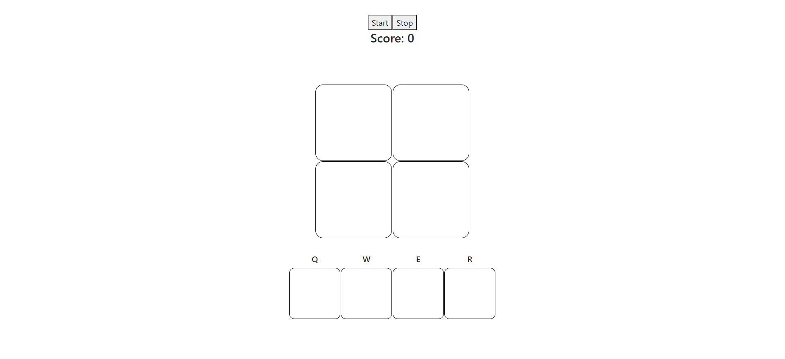
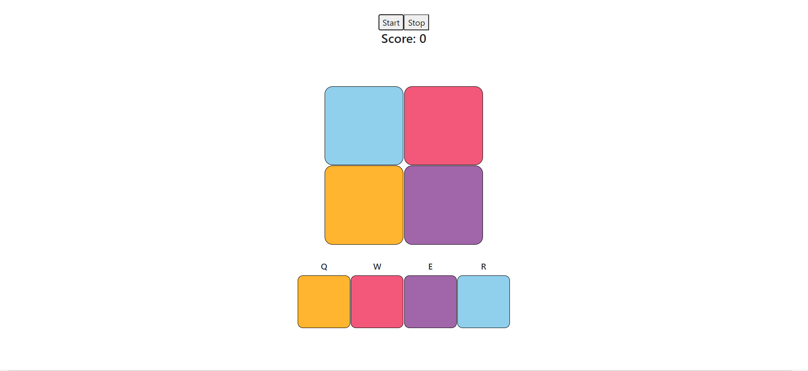
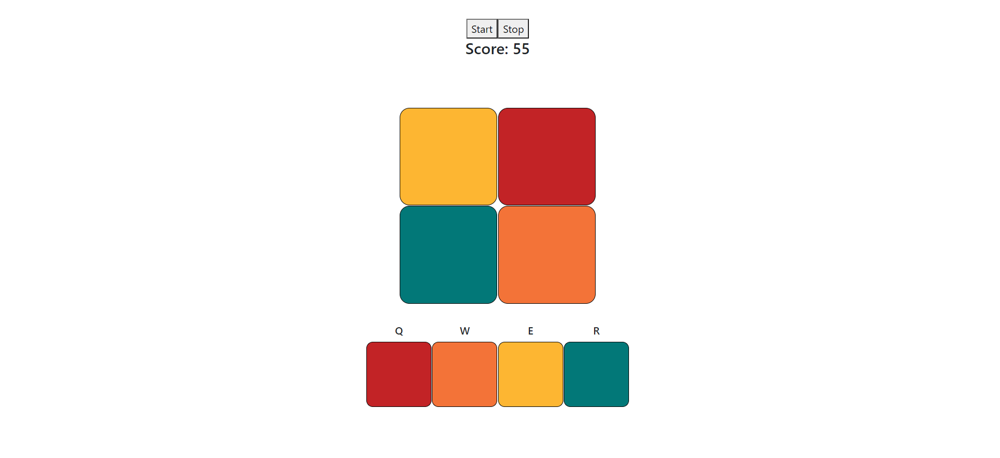

<h1 style="text-align: center; font-size: 50px;">Color Clicker</h1>

Color clicker es un juego <b>en desarrollo</b> bastante simple. La idea es la siguiente:
<ul>
  <li>
    Se tienen varias paletas de colores. Al iniciar el juego se selecciona una de forma aleatoria para usar.
  </li>
  <li>
    Se tiene un conjunto de celdas que usan dichos colores, la idea es que no se repitan.
  </li>
  <li>
    Se puede seleccionar un color usando el teclado.
  </li>
  <li>
    Al hacer click sobre una celda, si el color seleccionado es igual al de la celda entonces el jugador suma puntos, caso contrario resta puntos.
  </li>
  <li>
    Las celdas van cambiando de color usando un timer.
  </li>
</ul>
 
La idea es que haya distintos niveles de dificultad, aunque actualmente solo haya un nivel.
 
Aquí algunas imagenes para visualizar.

Imagen 1: antes de empezar el juego. Aún no se ha seleccionado la paleta de colores.

Imagen 2: se presionó el boton start y se seleccionaron los colores. Como el puntaje marca 0 aún no se empezó a jugar.

Imagen 3: Se empezó a jugar. Se puede ver que la paleta de colores difiere de la de la imagen 2 ya que es otra sesión, y se puede ver el puntaje actual.

